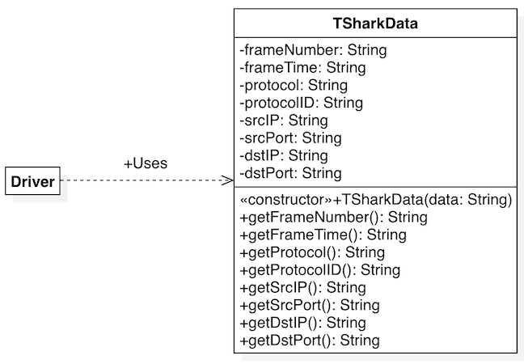
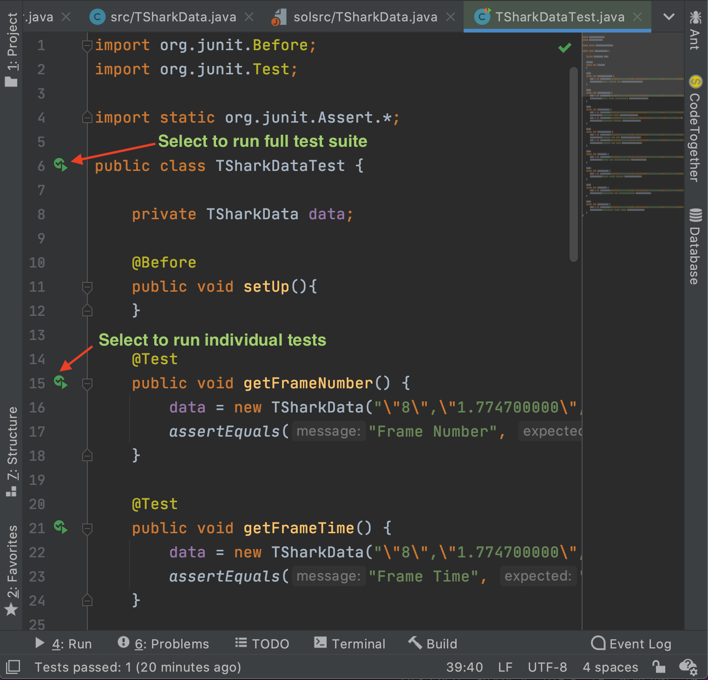
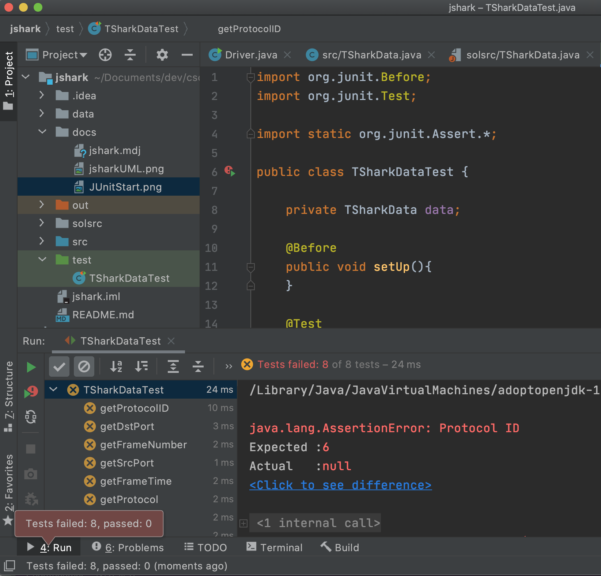

### Lab 04 - Scanner and JUnit
In this lab you will be practicing the following
* Use of the Scanner class to read data from a file
* Setting values of attributes of a class
* Use of operations from the String class
* Use of JUnit to test a class

### Sample Data
The following is a list of sample data that you might expect to be used. Note that there may be other samples.
Check the data directory for others.
```
"5","1.436394000","UDP","17","192.168.68.105","192.168.68.255",,,"889","889"
"6","1.536100000","ARP",,,,,,,
"7","1.774322000","TLSv1.2","6","192.168.68.126","52.114.159.112","55358","443",,
"8","1.774700000","TCP","6","192.168.68.126","52.114.159.112","55358","443",,
"9","1.779635000","DNS","17","192.168.68.126","71.10.216.1",,,"60389","53"
"10","1.780159000","TCP","6","192.168.68.126","52.114.159.32","55361","443",,
"11","1.780906000","TLSv1.2","6","192.168.68.126","34.192.73.106","55352","443",,
"12","1.781040000","TLSv1.2","6","192.168.68.126","34.192.73.106","55352","443",,
"13","1.813194000","DNS","17","71.10.216.1","192.168.68.126",,,"53","60389"
"14","1.825079000","TCP","6","34.192.73.106","192.168.68.126","443","55352",,
```

### Generating Data
Data can be generated using tshark (you must download and install [Wireshark](https://www.wireshark.org/index.html#download) including
tshark.
```bash
$ tshark -q -T fields -e frame.number -e frame.time_relative -e _ws.col.Protocol -e ip.proto -e ip.src -e ip.dst -e tcp.srcport -e tcp.dstport -e udp.srcport -e udp.dstport -E header=y -E separator=, -E quote=d -E occurrence=f > data.csv
```

### Classes
* TSharkData
    * Constructor: Use the Scanner class to read data and set individual attributes.
* Driver
    * This class is reserved for future use.
* TSharkDataTest
    * Use the TSharkDataTest to test the TSharkData class. 



### Running JUnit

##### Set up JUnit in your project

##### Select the appropriate icons to begin a test


##### First time executing JUnit should appear as follows

